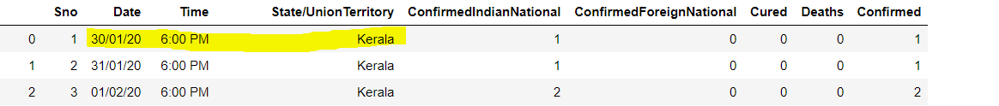

# Corona_india
Tabular and graphical representation of data related to corona
I am Using 2 python packages 
# Pandas
# Matplotlib

# Pandas 
pandas aims to be the fundamental high-level building block for doing practical, real world data analysis in Python. Additionally, it has the broader goal of becoming the most powerful and flexible open source data analysis / manipulation tool available in any language.

Library Highlights
A fast and efficient DataFrame object for data manipulation with integrated indexing;

Tools for reading and writing data between in-memory data structures and different formats: CSV and text files, Microsoft Excel, SQL databases, and the fast HDF5 format;

Intelligent data alignment and integrated handling of missing data: gain automatic label-based alignment in computations and easily manipulate messy data into an orderly form;

Flexible reshaping and pivoting of data sets;

# Matplotlib

Matplotlib is a comprehensive library for creating static, animated, and interactive visualizations in Python.

## Installation
You can find the installation documentation for the
[Jupyter platform, on ReadTheDocs](https://jupyter.readthedocs.io/en/latest/install.html).
The documentation for advanced usage of Jupyter notebook can be found
[here](https://jupyter-notebook.readthedocs.io/en/latest/).

For a local installation, make sure you have
[pip installed](https://pip.readthedocs.io/en/stable/installing/) and run:

    $ pip install notebook

# Coron story of india 

 The first case of the corona in India was found in Kerala on 30 January 2013
 

